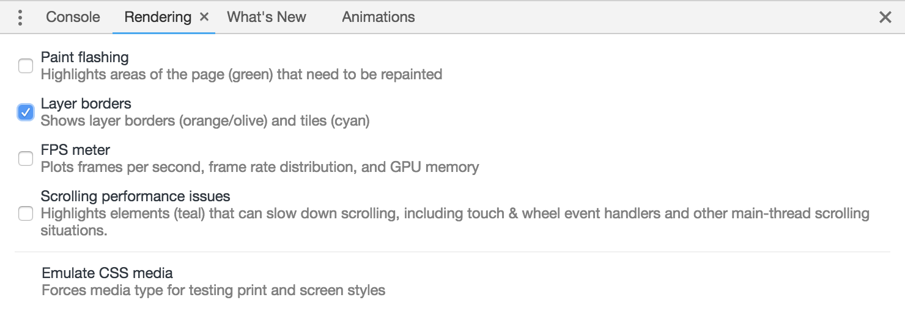
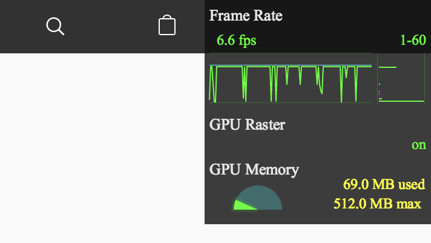

class: center, middle

# Rendering Performance

Best practices for improving rendering performance

---

### Where is rendering performance important?

- Transitions
- Animations
- Scrolling
- Inital page rendering
- Anytime the screen needs to be updated

---

### Anatomy of a frame


Image from [Aerotwist](https://aerotwist.com/blog/the-anatomy-of-a-frame/)

---

class: center, middle

## Animation Performance Basics

---

### Bad CSS animation

```css
@keyframes bad-animation {
  to {
    margin-left: 500px;
    background: white;
  }
}
```

<div class="ball ball--bad-css ball--css" onclick="toggleCSSAnimation(this)"></div>

--

#### Why?

- Animated properties (`margin-left` and `background`) require a layout and paint operation each frame. See [CSS triggers](https://csstriggers.com/)


---

### Good CSS animation

```css
@keyframes good-animation {
  to {
    transform: translateX(500px);
    opacity: 0;
  }
}
```

<div class="ball ball--good-css ball--css" onclick="toggleCSSAnimation(this)"></div>

--

#### Why?

- `transform` and `opacity` don't require a layout or paint operation
- Animation can be moved to the GPU process. This results in better performance, particularly on mobile devices where CPU power is limited.
- Notice that the circle is promoted to its own graphics layer.

---


### Bad JS animation

```js
let x = 0

setInterval(function() {
  x = (x + 1) % 500
  elem.style.transform = `translateX(${x}px)`
}, 16)
```

<div class="ball ball--bad-js ball--js" onclick="toggleBadJSAnimation(this)"></div>

--

#### Why?

- `setInterval` forces the browser to render before the next frame is ready to be drawn, resulting in jerky animation.

---

### Good JS animation

```js
let x = 0

const tick = () => {
  x = (x + 1) % 500

  elem.style.transform = `translateX(${x}px)`
  requestAnimationFrame(tick)
}

tick()
```

<div class="ball ball--good-js ball--js" onclick="toggleGoodJSAnimation(this)"></div>

--

#### Why?

- Uses `requestAnimationFrame` so that rendering is deferred until the browser is ready to draw the next frame.

---

class: center, middle

## Layer Promotion

---

### When is an element promoted?

  - The element has a 3D transform applied `transform: translateZ(0)`
  - The element has `will-change: transform`


---

### How to debug layers




---

### Use `will-change` with caution

Each layer consumes GPU memory. The larger the element, the more GPU memory it uses.




---

### Avoid

```css
.ball {
  transition: 1s transform ease-out;
}

.ball--animating {
  will-change: transform;
  transform: translateX(100px);
}
```

#### Why?

- The browser needs time to create a layer. This delays the start of the animation and makes the UI feel less responsive.

---

### Prefer

```css
.ball {
  transition: 1s transform ease-out;
  will-change: transform;
}

.ball--animating {
  transform: translateX(100px);
}
```

#### Why?

- The layer is created ahead of time so the browser doesn't need to do any work immediately before the animation starts
- The UI feels more responsive

---

class: center, middle

## Scrolling Performance

Parallax, scroll-triggered transition, etc.

---

### How to reach 60FPS scrolling

- Only animate `transform` and `opacity`. See [CSS triggers](https://csstriggers.com/)
- [Avoid synchronous style and layout calculation](https://gist.github.com/paulirish/5d52fb081b3570c81e3a) also known as "reflow"
- Cache as much as possible
- Use `will-change: transform` but watch GPU memory consumption

---

### Workshop

How can we optimize this?

<iframe
  height='450'
  scrolling='no'
  title='yxBgwL'
  src='//codepen.io/peterhry/embed/yxBgwL/?height=450&theme-id=0&default-tab=result&embed-version=2'
  frameborder='no'
  allowtransparency='true'
  allowfullscreen='true' style='width: 100%;'>See the Pen
  <a href='https://codepen.io/peterhry/pen/yxBgwL/'>yxBgwL</a> by Peter Hrynkow (<a href='https://codepen.io/peterhry'>@peterhry</a>) on <a href='https://codepen.io'>CodePen</a>.
</iframe>

---

class: center, middle


## Thank You

---
